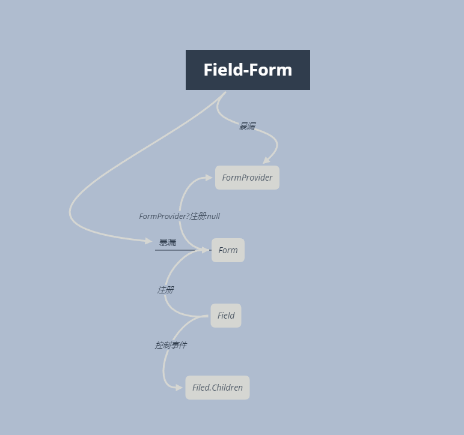

# Field-form

React Performance First Form Component.

* github地址:[field-form](https://github.com/react-component/field-form)

* Field-form是antd v4.0的Form组件的底层组件

## 整体的逻辑架构



大体逻辑如上

 ```markdown

 <Form>
          <Field name="username">
            <Input placeholder="Username" />
          </Field>
          <Field name="password">
            <Input placeholder="Password" />
          </Field>
          <Field name="username">
            <Input placeholder="Shadow of Username" />
          </Field>
          <Field name={['path1', 'path2']}>
            <Input placeholder="nest" />
          </Field>
</Form>

```

上面是一段很基本的代码....我们就从`example` 入手,Field会在组件挂载完成的时候注册到Form中，Form会获得每个Field的实例,当操作Field.Children下的组件的时候

会通过dispatch通知Form---------------Field.Children会在渲染的时候会被劫持掉onChange(这个是通过trigger来指定的，默认是onChange)

Form就会调用每个Field的onStoreChange来对Field进行操作.

我们也可以通过Form暴漏的方法对Field进行修改,Form暴漏给用户的方法基本都在getForm中了

## Form.ts

```markdown

 {
    name,
    initialValues,
    fields,
    form,
    children,
    component: Component = 'form',
    validateMessages,
    validateTrigger = 'onChange',
    onValuesChange,
    onFieldsChange,
    onFinish,F
    onFinishFailed,
    ...restProps
  }: FormProps,
  ref,
) =>
  // We customize handle event since Context will makes all the consumer re-render:
  // https://reactjs.org/docs/context.html#contextprovider
  const [formInstance] = useForm(form);
  
  const {
    useSubscribe,
    setInitialValues,
    setCallbacks,
    setValidateMessages,
  } = (formInstance as InternalFormInstance).getInternalHooks(HOOK_MARK);
  // Pass ref with form instance
  React.useImperativeHandle(ref, () => formInstance);
  // Register form into Context
  // Pass props to store
  setValidateMessages({
    ...validateMessages,
  });
  setCallbacks({
    onValuesChange,
    onFieldsChange: (changedFields: FieldData[], ...rest) => {
      formContext.triggerFormChange(name, changedFields);
      if (onFieldsChange) {
        onFieldsChange(changedFields, ...rest);
      }
    },
    onFinish: (values: Store) => {
      formContext.triggerFormFinish(name, values);
      if (onFinish) {
        onFinish(values);
      }
    },
    onFinishFailed,
  });

  // Set initial value, init store value when first mount
  const mountRef = React.useRef(null);
  setInitialValues(initialValues, !mountRef.current);
  if (!mountRef.current) {
    mountRef.current = true;
  }

  // Prepare children by `children` type
  let childrenNode = children;
  const childrenRenderProps = typeof children === 'function';
 
  if (childrenRenderProps) {
    const values = formInstance.getFieldsValue(true);
    
    childrenNode = (children as RenderProps)(values, formInstance);
  }

  // Not use subscribe when using render props
  useSubscribe(!childrenRenderProps);

  // Listen if fields provided. We use ref to save prev data here to avoid additional render
  const prevFieldsRef = React.useRef<FieldData[] | undefined>();
  React.useEffect(() => {
    if (!isSimilar(prevFieldsRef.current || [], fields || [])) {
      formInstance.setFields(fields || []);
    }
    prevFieldsRef.current = fields;
  }, [fields, formInstance]);
  const formContextValue = React.useMemo(
    () => ({
      ...(formInstance as InternalFormInstance),
      validateTrigger,
    }),
    [formInstance, validateTrigger],
  );
  const wrapperNode = (
    <FieldContext.Provider value={formContextValue}>{childrenNode}</FieldContext.Provider>
  );
```


删除了一些代码，对于整体的逻辑并无大碍

当我们没有提供Form.prop.form.`formInstance`就是我们useForm.getForm()...getForm我们说过就是Form暴漏的方法给用户

最后全部都会注入到Field给Field消费...


## Field.ts

```markdown
public static contextType = FieldContext;

public static defaultProps = {
    trigger: 'onChange',
    valuePropName: 'value',
  };

public componentDidMount() {
    const { shouldUpdate } = this.props;
    const { getInternalHooks }: InternalFormInstance = this.context;
    const { registerField } = getInternalHooks(HOOK_MARK);
    this.cancelRegisterFunc = registerField(this);
    // One more render for component in case fields not ready
    if (shouldUpdate === true) {
      this.reRender();
    }
}
```

getInternalHooks是FieldContext给Field消费的....然后获取Form中的registerField完成注册....

```markdown

public onStoreChange: FieldEntity['onStoreChange'] = (prevStore, namePathList, info) => {
    const { shouldUpdate, dependencies = [], onReset } = this.props;
    const { getFieldsValue }: FormInstance = this.context;
    const values = getFieldsValue(true);
    const namePath = this.getNamePath();
    const prevValue = this.getValue(prevStore);

    const curValue = this.getValue();
    const namePathMatch = namePathList && containsNamePath(namePathList, namePath);

    // `setFieldsValue` is a quick access to update related status
    if (info.type === 'valueUpdate' && info.source === 'external' && prevValue !== curValue) {
      this.touched = true;
      this.dirty = true;
      this.validatePromise = null;
      this.errors = [];
    }
    switch (info.type) {
      case 'reset':
        if (!namePathList || namePathMatch) {
          // Clean up state
          this.touched = false;
          this.dirty = false;
          this.validatePromise = null;
          this.errors = [];
          if (onReset) {
            onReset();
          }
          this.refresh();
          return;
        }
        break;

      case 'setField': {
        if (namePathMatch) {
          const { data } = info;
          if ('touched' in data) {
            this.touched = data.touched;
          }
          if ('validating' in data && !('originRCField' in data)) {
            this.validatePromise = data.validating ? Promise.resolve([]) : null;
          }
          if ('errors' in data) {
            this.errors = data.errors || [];
          }
          this.dirty = true;
          this.reRender();
          return;
        }

        // Handle update by `setField` with `shouldUpdate`
        if (
          shouldUpdate &&
          !namePath.length &&
          requireUpdate(shouldUpdate, prevStore, values, prevValue, curValue, info)
        ) {
          this.reRender();
          return;
        }
        break;
      }

      case 'dependenciesUpdate': {
        /**
         * Trigger when marked `dependencies` updated. Related fields will all update
         */
        const dependencyList = dependencies.map(getNamePath);
        if (
          namePathMatch ||
          dependencyList.some(dependency => containsNamePath(info.relatedFields, dependency))
        ) {
          this.reRender();
          return;
        }
        break;
      }

      default:
        /**
         * - If `namePath` exists in `namePathList`, means it's related value and should update.
         * - If `dependencies` exists in `namePathList`, means upstream trigger update.
         * - If `shouldUpdate` provided, use customize logic to update the field
         *   - else to check if value changed
         */
        if (
          namePathMatch ||
          dependencies.some(dependency =>
            containsNamePath(namePathList, getNamePath(dependency)),
          ) ||
          requireUpdate(shouldUpdate, prevStore, values, prevValue, curValue, info)
        ) {
          this.reRender();
          return;
        }
        break;
    }

    if (shouldUpdate === true) {
      this.reRender();
    }
  };

```
